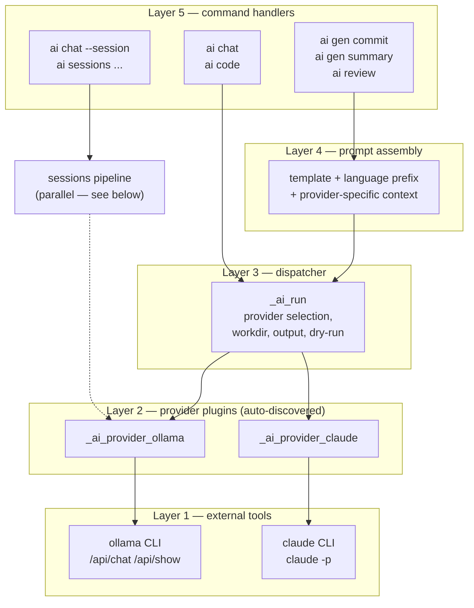
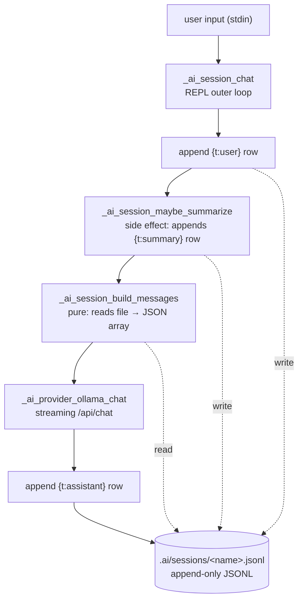

# AI toolkit architecture

> See also: [Toolkit reference](toolkit.md) · [Sessions](sessions.md) · [How-to](howto.md)

This document describes the design of the `ai` toolkit — its layers, contracts, and the invariants that should remain true as the code evolves. Command names appear only as illustrations; user-facing behavior is documented in [toolkit.md](toolkit.md).

## Goals

The `ai` toolkit is a fish-native CLI front-end to multiple AI providers. It exists to:

1. Give one consistent command surface regardless of underlying provider (Ollama, Claude, future providers).
2. Persist preferences (provider, model, prompts) per task and per project — not just globally.
3. Support stateful conversations (sessions) for providers that don't have native session management.
4. Keep prompt engineering user-editable without touching shell code.
5. Stay fish-shell idiomatic — autoloaded functions, no heavy dependencies, `stow` symlinks.

The architecture is a stack of independent layers. Each layer has one responsibility, knows about the layer directly below it, and exposes a stable contract upward.

## System overview



**Layer responsibilities (bottom-up):**

| Layer | Responsibility | Knows about |
|---|---|---|
| 1 (boundary) | The external tool itself | — (external) |
| 2 (provider plugin) | How to invoke this specific tool | The tool's CLI/API |
| 3 (dispatcher) | Provider selection, workdir, output, dry-run | All providers via discovery |
| 4 (prompt assembly) | Build the prompt with context for the chosen provider | The task domain + provider capabilities |
| 5 (command handler) | The user-facing command | The task (commit/review/etc) |

Sessions sit beside this stack as a parallel pipeline with its own storage and context management — described in [sessions.md](sessions.md).

## Layer 2: provider plugins

The toolkit treats providers as plug-ins. Each provider is a single fish function named `_ai_provider_<name>` that knows nothing about the broader system — only how to invoke its specific tool.

**Contract** (called by the dispatcher):

```
_ai_provider_<name> [--interactive] [--model M] [--think]

Non-interactive (default):
  reads stdin (prompt + piped input as a single stream)
  writes the response to stdout
  returns the tool's exit status

Interactive (--interactive):
  takes over TTY (no stdin to consume)
  ignores --model if the tool doesn't support one
```

`--think` is accepted by all plugins for interface symmetry; providers without thinking support silently ignore it.

**Discovery.** `_ai_providers` enumerates plugin functions via `functions -an`, filters to names matching `^_ai_provider_(?<name>.+)$`, then validates each is loadable with `functions -q`. The result is the canonical list of available providers — used by completions, config validation, and the dispatcher.

**Adding a provider.** Create one file:

```
fish/.config/fish/functions/_ai_provider_<name>.fish
```

It is picked up automatically. No registration step, no code changes elsewhere. The function is autoloaded on first invocation by fish.

**Dispatcher behavior.** `_ai_run` argparses common flags (`--provider`, `--model`, `--think`, `--workdir`, `--output`, `--dry-run`), resolves the provider name via the resolver chain (Layer 2), looks up the function via `functions -q _ai_provider_$provider`, then:

- If `--dry-run`: prints the assembled prompt to stdout, label to stderr, returns 0 without invoking the plugin.
- If interactive (no prompt, no piped stdin, no output redirect): calls the plugin with `--interactive`.
- Otherwise: pipes `_ai_pipe_input "$prompt"` (which emits the prompt argument followed by stdin if piped) into the plugin, redirects output to `--output` file or stdout via `/dev/stdout`.

`--workdir` is honored at the dispatcher level: `cd` before invocation, restore original PWD on exit. This is how Claude can read project files in `ai review PATH` mode.

## Layer 3: configuration

Configuration is layered, not monolithic. A value can be set globally, scoped to a project, or scoped to a specific task. The resolver returns the most specific match.

**Files:**

| Location | Scope | Owns |
|---|---|---|
| `<project>/.ai/config` (walk-up) | Project | Per-project + per-task-per-project overrides |
| `~/.config/ai/config` | Global | Global + per-task global overrides |
| `$AI_DEFAULT_MODEL` env | Shell | Legacy global model fallback |

**Format.** Plain `key=value` lines. Schema:

| Key | Scope | Notes |
|---|---|---|
| `provider` | Top-level | Default provider for unspecified tasks |
| `<task>_provider` | Per-task | Override for a specific task |
| `<task>_model` | Per-task | Model for a specific task (any provider) |
| `sessions_recent_turns` | Sessions | Sliding-window target |
| `sessions_token_threshold` | Sessions | Truncation threshold (fraction of context window) |
| `sessions_summary_model` | Sessions | Override model used for rolling summary |

Known tasks: `chat`, `code`, `review`, `verify`, `commit`, `summary` (enumerated by `_ai_tasks`). The `verify` task configures the second-opinion pass of `ai review --verify` independently of the review task itself (so you can review with one provider/model and verify with another).

**Walk-up resolution.** Project config is discovered by `_ai_project_config_file`: from `$PWD`, walk up the directory tree checking each ancestor for `.ai/config`. Stop conditions, in order:

1. `$dir == $HOME` or `$dir == /` → no project config.
2. `$dir/.ai/config` exists → return it.
3. `$dir/.git/` exists → check this dir only (git root is the project boundary), then stop.

This means a session or config can live at the git root and apply to all subdirectories without explicit per-folder setup.

**Read resolver chain** (`_ai_config_read KEY`):

```
1. project .ai/config → if KEY present, return it
2. ~/.config/ai/config → if KEY present, return it
3. (caller falls back to env var or hardcoded default)
```

This is implemented in a single function and shared by all higher-level resolvers (`_ai_default_provider`, `_ai_default_model`, `_ai_origin_*`).

**Write target.** Writes don't follow the same chain — they go to one specific file:

- Without `--project`: always `~/.config/ai/config`.
- With `--project`: `_ai_project_config_target` returns either the existing project config path (if walk-up finds one) or computes a new one (`<git-root>/.ai/config`, or `<cwd>/.ai/config` if not in a repo).

So once a project has a `.ai/config`, both reads and writes to it are sticky.

**`move` semantics.** `ai config move --task X --to {project|global}` is shorthand for "read keys from the opposite layer, write to the target layer, remove from source". Conflict resolution: target's value is overwritten by source's. The user said "move", which means the source value wins.

## Layer 4: per-task model and provider resolution

Tasks are an axis of personalization. The user may want:

- `chat` → ollama qwen3.5:9b (fast)
- `code` → ollama qwen2.5-coder:32b (specialized)
- `review` → claude (better at judgment)
- `commit` → ollama qwen2.5-coder:7b (small + fast for short messages)

Each command handler knows its task identifier and passes it into resolvers.

**Resolver contract:**

```fish
_ai_default_provider [TASK]
  TASK   optional task identifier
  Returns: provider name (always non-empty)
  Chain:
    1. <task>_provider from config (if TASK given)
    2. provider from config
    3. "ollama"

_ai_default_model [TASK] [PROVIDER]
  TASK     optional task identifier
  PROVIDER optional provider hint
  Returns: model name (may be empty for non-ollama)
  Chain:
    1. <task>_model from config (if TASK given) — any provider
    2. $AI_DEFAULT_MODEL env (only if PROVIDER is ollama or unspecified)
    3. Hardcoded fallback "qwen3.5:9b" (only if PROVIDER is ollama or unspecified)
  Non-ollama with no per-task model → empty result; caller passes no
  --model and lets the provider use its native default.
```

**Origin tracking** (`_ai_origin_provider`, `_ai_origin_model`) mirrors the same logic but returns a label instead of the value (`project`, `global`, `env`, `default`). This is what powers the resolved view (`ai config status`).

**Where callers use this.** Each command handler resolves before any side effects:

```
provider = --provider flag       OR _ai_default_provider <task>
model    = --model flag          OR _ai_default_model <task> <provider>
```

This pre-resolution happens BEFORE any `cd $workdir` or session loading, so resolvers see the user's invocation PWD (not the internal workdir).

## Layer 5: prompt templates

Prompts are user-editable, not buried in shell code. Each generation/review command has a template file:

```
~/.config/fish/prompts/
├── meta-commit.md           (ai gen commit)
├── meta-summary.md          (ai gen summary)
├── meta-review.md           (ai review PATH — target mode)
├── meta-review-diff.md      (ai review — git mode)
└── meta-session-summary.md  (rolling summary for long sessions)
```

(These are symlinked from the dotfiles repo via stow.)

**Loader pattern.** Every command that uses a template follows the same shape:

```fish
set -l template_file ~/.config/fish/prompts/meta-<name>.md
set -l prompt
if test -f $template_file
    set prompt (cat $template_file | string collect)
else
    set prompt "<minimal inline fallback>"
end
```

If the user deletes or moves a template, the command still works with a compact built-in default. The user can iterate on prompt engineering without touching fish code, just by editing the `.md` file.

**Where assembly happens.** Templates are the "what to say" part. Assembly (combining template + context + language instruction + custom user prompt + the actual content) is the responsibility of each command handler. See [Layer 6: provider-specific assembly](#layer-6-provider-specific-assembly).

## Layer 6: provider-specific assembly

Different providers have different capabilities. Claude CLI can read files from the working directory. Ollama (which we invoke via HTTP API) has no filesystem access. The prompt assembly must reflect that.

**The split.** Inside a command handler:

- Common: load template, resolve task model, build language prefix, attach custom prompt suffix.
- Provider-specific: build the final `full_prompt` string.
  - **Claude**: just the template + custom instructions. Tell it to review/summarize the target. The actual file content is read by Claude itself (it has access to the working directory).
  - **Ollama**: template + embedded context (tree output, README excerpt, file content). Everything Ollama needs must be in the prompt because it cannot read files.

**Where the workdir matters.** `_ai_run --workdir DIR` does the `cd` before invoking the provider, so Claude sees the right directory. For ollama, the workdir cd happens too, but it's irrelevant (no files are read at runtime). The workdir is recorded only as context delivery to Claude.

**Why this split is right.** The provider plugin layer (Layer 2) handles HOW to invoke each tool. The prompt assembly (Layer 4–5) handles WHAT to send. Mixing them would either:

- Force the runner to know about file contents (leaking into Layer 2), or
- Force the prompt to embed content even for Claude (wasteful and weakens Claude's exploration).

By keeping the split — context assembly in the command handler, invocation in the plugin — both providers get what they need without the layers leaking into each other.

## Sessions: a parallel pipeline

Sessions are a separate concern from one-shot commands. They have their own storage, their own context management, and their own provider boundary.

**Architectural decision: sessions are ollama-only.**

Claude has its own native session story (`claude --resume`, internal storage in `~/.claude/projects/`). The toolkit deliberately does NOT bridge to it. Reasons:

- **Abstraction integrity.** A bridge would surface "what works for ollama doesn't work for claude" inconsistencies. Better to have one clean feature (ollama sessions) and let claude users go to claude CLI for its own session story.
- **Don't depend on another product's internals.** Claude's storage format is private API. Parsing it would create unmaintainable coupling.
- **Symmetric with how the toolkit treats other tools.** We don't manage pi's sessions, opencode's memory, or future cline's Kanban. Each tool owns its territory.

When the user passes `--session NAME --provider claude` (or task resolution selects claude), the command errors with a clear redirect to `claude --resume` / `claude -c`.

**Pipeline overview:**



Storage layout, JSONL types, the `covers` field, and the truncation algorithm are documented in detail in [sessions.md](sessions.md). The architectural points here are:

1. **Append-only JSONL** for concurrency tolerance and append atomicity.
2. **Side-effect separation.** `build_messages` is pure (read → return array). `maybe_summarize` is the side-effect step (write to file). Calling them in order keeps the contract clean.
3. **Walk-up symmetric with config.** Sessions and config use the same walk-up algorithm. Same boundaries (git root, $HOME, /).
4. **`covers` field as durable cursor.** A summary block records how many turn messages it covers. The builder skips that many on next call. No external pointer to maintain.

## Design invariants

These should stay true as the code evolves:

1. **One-shot stateless paths stay backward-compatible.** Adding sessions did not change `ai chat`, `ai gen commit`, `ai review --last 3`. The new code path is additive.

2. **Adding a provider is one file.** No registration in `_ai_providers` or other index. Discovery is via `functions -an`. A new file in `functions/` is sufficient.

3. **Adding a task identifier is one config key per scope.** No code changes needed in resolvers. Only in command handlers if they want to use it.

4. **Adding a prompt template is one file.** No fish code changes; loader pattern handles fallback.

5. **Project config beats global config.** Always. No exceptions. If a user sets something in project, they meant it.

6. **Sessions are ollama-only by design.** This is not a temporary limitation. Bridging claude (parsing its storage, mapping IDs) is rejected as architecturally wrong. See [the sessions boundary](#sessions-a-parallel-pipeline).

7. **No filesystem access from provider plugins.** Plugins know about their tool. Reading files for context delivery is the command handler's responsibility (Layer 4-5).

8. **Resolvers are pure.** `_ai_default_provider`, `_ai_default_model`, `_ai_config_read` have no side effects, no caching mutations. Read-only.

9. **Pre-resolve before workdir cd.** Command handlers resolve provider/model from the user's invocation PWD, BEFORE entering any internal `cd`. This ensures project config is taken from where the user invoked, not where the runner walked to.

10. **JSONL append-only.** Once a session row is written, it stays. Operations that "modify" sessions (clear, edit) rewrite the file under the hood, but the runtime expectation is that turns and summaries are append-only.

## Cross-cutting concerns

**Dry-run.** `--dry-run` is implemented at the dispatcher (Layer 3) and forwarded through all command handlers. The dispatcher prints the assembled prompt to stdout, a label to stderr, and returns 0 before invoking the provider. Command handlers detect `--dry-run` to suppress side-effect cues ("Saved to: $file" message when nothing was saved).

**Completions.** `completions/ai.fish` consumes the same discovery mechanisms used at runtime: `_ai_providers` for provider names, `_ai_tasks` for task names, `_ai_session_names` for session names, `ollama list` for installed models. So tab-completion is automatically consistent with what the toolkit knows about.

**Stow.** Files in the repo at `fish/.config/fish/functions/`, `prompts/`, `completions/` are symlinked into `~/.config/fish/` by `install.sh` (which wraps `stow`). When new files are added or deleted in the repo, `stow --restow fish` and `find … -type l ! -exec test -e {} \;` should be run to update symlinks and prune broken ones.

**Error surface.** Error messages are user-facing: red `set_color`, prefixed with "Error:", followed by a hint for resolution. Warnings are yellow `set_color`. The pattern is: explain what failed, then say what the user should do.

## Boundaries and what we deliberately don't do

| Concern | Status |
|---|---|
| Bridge to claude CLI sessions | Rejected — each tool owns its territory |
| Direct Anthropic API access | Rejected — API gating, requires separate billing |
| Manage pi / opencode / claude-code state | Rejected — same boundary principle |
| Vector search / embeddings for sessions | Not yet — out of scope for current implementation |
| Cross-provider session migration | Rejected — sessions are scoped to one provider for life |
| Encryption for sessions storage | Not yet — could be added without changing architecture |
| Per-project prompt templates | Not yet — straightforward extension of the walk-up pattern |
| Streaming for `ai gen`/`ai review` | Not yet — current API path uses HTTP non-streaming for these |

These are architectural decisions, not bugs. They can be revisited if user pain emerges.
